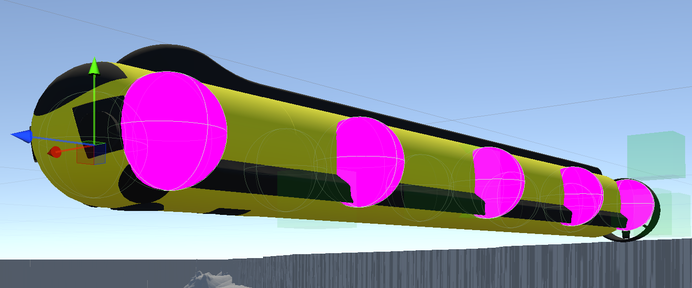
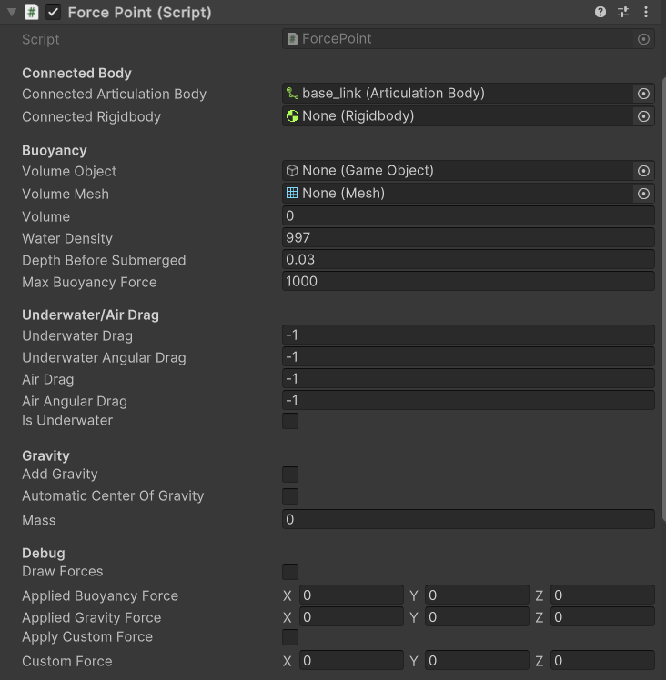
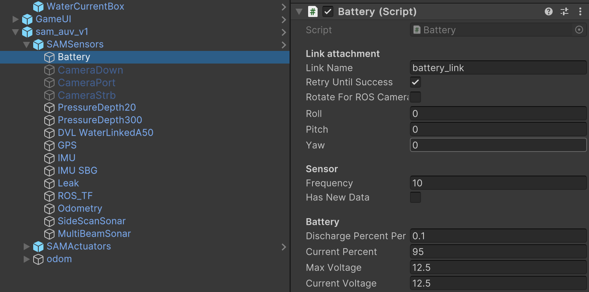
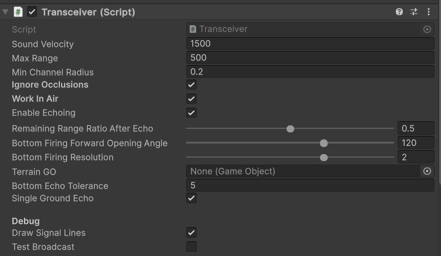
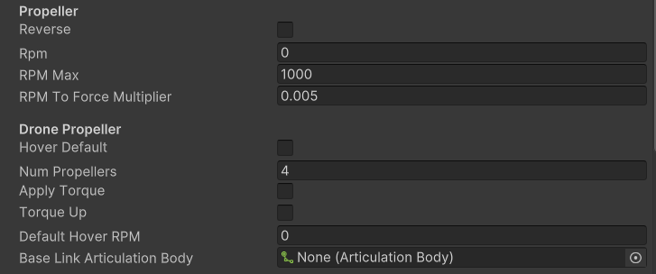
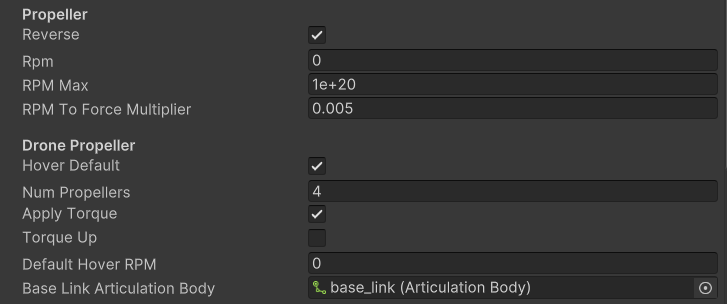
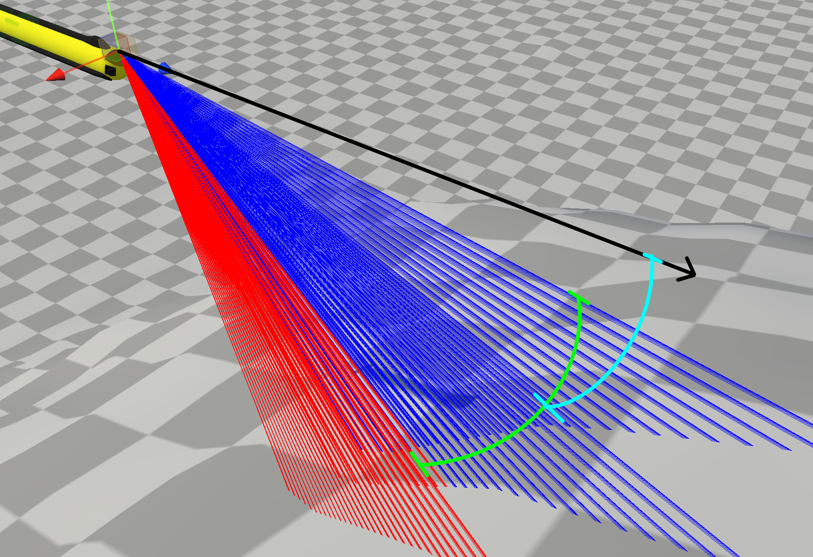
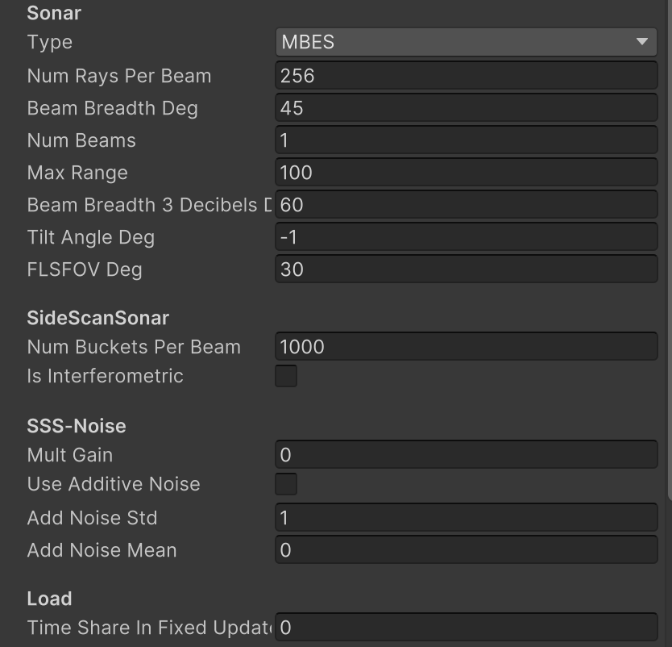

# SMaRC Unity Assets
**Table of contents:**
- [SMaRC Unity Assets](#smarc-unity-assets)
  - [General Concepts and Phrases](#general-concepts-and-phrases)
  - [Force](#force)
    - [ForcePoint](#forcepoint)
    - [(Something)ForceModel](#somethingforcemodel)
  - [Water](#water)
    - [SimpleWaterQueryModel](#simplewaterquerymodel)
    - [SimpleWaterCurrent](#simplewatercurrent)
  - [Vehicle Components](#vehicle-components)
      - [Update rates](#update-rates)
      - [LinkAttachment](#linkattachment)
    - [Acoustics](#acoustics)
      - [Transceiver(TX)](#transceivertx)
        - [Occlusions](#occlusions)
        - [Propagation speed](#propagation-speed)
        - [Surface echoes](#surface-echoes)
        - [Bottom echoes](#bottom-echoes)
        - [Configuration](#configuration)
    - [Actuators](#actuators)
      - [Hinge](#hinge)
      - [Prismatic](#prismatic)
      - [VBS](#vbs)
      - [Propeller](#propeller)
    - [Sensors](#sensors)
      - [Battery](#battery)
      - [Camera Image](#camera-image)
      - [DepthPressure](#depthpressure)
      - [DVL](#dvl)
      - [GPS](#gps)
        - [GPSReferencePoint](#gpsreferencepoint)
      - [IMU](#imu)
      - [Leak](#leak)
      - [Sonar](#sonar)
    - [ROS](#ros)
      - [Core](#core)
        - [RosMessages](#rosmessages)
        - [Clock](#clock)
        - [ROSPublisher](#rospublisher)
      - [Publishers](#publishers)
        - [TF](#tf)
      - [Subscribers](#subscribers)
  - [Rope](#rope)
  - [Importer](#importer)
  - [Drone](#drone)
  - [GameUI](#gameui)


## General Concepts and Phrases
- **Body**: Refers to either an Articulation Body(AB), or a Rigidbody(RB) in Unity. 
Since most of the time these two share the physical properties, we refer to them collectively as Bodies.

- **Standard**: The Standard Unity project found [here](https://github.com/smarc-project/SMARCUnityStandard)

- **HDRP**: The High Def. Rendering Pipeline Unity project found [here](https://github.com/smarc-project/SMARCUnityHDRP)


## Force
Simulation of water-related custom forces that are applied to Bodies. 

### ForcePoint
A generalized massless point in space where external forces are applied.
This script is usually attached to many GameObjects and made child of a Body. 
Most commonly used for approximate buoyancy forces, water currents and gravity. 
For buoyancy and water currents, queries the [Water](#water) model to check for depth and current vector.

The more of these you put on a vehicle and the denser they are, the more accurate the forces will become.

Example:

The force points are shown as magenta spheres. 
They are children to the `base_link` object which contains a Body.


- Connected Body: Either an articulation body or a rigidbody can be assigned here. Usually the `base_link` of a robot.
- Buoyancy
  - Volume Object: An object can be assigned to automatically assign the mesh from.
  - Volume Mesh: A mesh can be assigned to calculate the volume from.
  - Volume: Volume can be set directly.
  - Water Density: In Kg/m3, density of the fluid to calculate buoyancy forces from. 
  - Depth Before Submerged: A workaround the fixed delta time simulation steps. When set to zero, the force points tend to produce high frequency oscilations. In one update it is in water and in the next it is out. To prevent this, some depth is allowed without applying the full buoyancy force. This smooths out the oscilations.
- Gravity
  - Add Gravity: If checked, this force point will add a gravity force as well.
  - Automatic Center of Gravity: If checked, the center of gravity of the object is calculated based on the locations of the force points it has. This can be useful when the object they are attached to has complicated geometry.
  - Mass: If gravity is to be applied, the mass of the entire object. The mass will also be distributed among the forcepoints, similarly to buoyancy forces.


### (Something)ForceModel
An analytical model of a vehicle. 
Since Unity only provides a rigid body simulation, some physical modelling (like hydrodynamic forces, damping) must be done "manually". 
These "ForceModel" scripts do just that and are specific to the vehicle they model, such as SAM and BlueROV.


## Water
We do not simulate water as particles, but as vector fields and a surface.
[ForcePoint](#forcepoint)s are used to apply the appropriate forces.

### SimpleWaterQueryModel
Used to define an interface for any object within the Unity world to get the Y(height) value of the water surface at a given point.
While in Standard the water surface is a plane at a fixed Y, in HDRP water surface is simulated with waves and thus has different heights at different times and locations.

This is used for GPS fixes, pressure measurements, buoyancy forces and so on.

HDRP Water:


### SimpleWaterCurrent
A simple vector field within a volume that applies forces to any ForcePoints within it.
Used to simulate currents within that volume.

Two volumes with different currents, mixing in overlapping regions.
Currents visualized with WaterCurrentVisualizer:


## Vehicle Components
These are the components that can be collected within a vehicle: usually sensors and actuators.
Optionally with ROS connections.
Most of them reflect real objects and some are abstractions.

- A general idea used for vehicle components is that the structure of the vehicle and its functional parts are defined separately within the robot object.
  - The structure part only contains geometry and Bodies, essentially reflecting a URDF file.
  - The functional parts are all agnostic to their poses, like a packaged real sensor, they can be mounted anywhere.

#### Update rates
Unless specified separately, vehicle components that work with the physics engine (only few exceptions) use the `FixedUpdate()` method of Unity.
This means that the update rate of all of them is limited to the physics update rate of Unity, meaning by default they can be updated at 50hz maximum.
See [the unity documentation](https://docs.unity3d.com/ScriptReference/MonoBehaviour.FixedUpdate.html) for details.

#### LinkAttachment
A base class that most sensors and actuators extend. 

In general, we aim to keep the _function_ of a component and its _pose_ separete from each other: Many robots are defined with URDF files which only define a geometric structure of where everything is and connected to what. 
These URDF files tend to change over the lifetime of a robot, a camera is moved elsewhere, some sensor is turned around, but the component itself does not change, only it's _pose_. 

> Imagine the LinkAttachment mechanism as the ability to disassemble a robot on a table.
> Unlike reality, our robots can assemble themselves automatically at run-time :)

- A GameObject with a LinkAttachment component is given a string name in the editor.
- At `Awake()` this GameObject's parent is set to be the GameObject with the given name that is under the same root object.

> If you have written a new LinkAttachment-extending class, and need to use the `Awake()` method yourself, you need to call `Attach()` manually.
> See for example `Sonar.cs`.

For example, a Battery object. Before play mode, it is under `sam_auv_v1/SAMSensor`:

And at play mode, it is under `sam_auv_v1/odom/base_link/battery_link`:


- Rotate For ROS Camera: The camera origin is different in Unity and in ROS.
Checking this box ON rotates the LinkAttachment object to match the ROS standard.
- The Roll/Pitch/Yaw fields can be used to rotate the LinkAttachment object _after_ it is attached.
In general it is a better idea to modify the structure part of the robot (usually the URDF) instead of using this.


### Acoustics
Peer to peer acoustic communications.

#### Transceiver(TX)
Simulates both a receiver and a transmitter of acoustic signals at the package level. 
The main way to interact with a transceiver are its `Read()` and `Write()` methods.
- `Read()`: Returns a StringStamped object that was received first. Contains the data as a string, the time it was sent and the time it was received.
- `Write()`: Takes a string and puts it in the write-queue. The string is broadcast in the next `FixedUpdate()`, first-in-first-out.

We provide different levels of realism when simulating a transceiver:

##### Occlusions
We make use of sphere-casting to determine occlusions.
When a transceiver broadcasts, it performs a sphere-cast to _every_ other transceiver in the scene.
If the cast is free of obstacles, we consider that path free.
The required obstacle-free width can be configured.

##### Propagation speed
We use coroutines to simulate the propagation speed of sound.
If the path is clear and the target is within range, a coroutine is started: The target's `Receive()` method is called after a delay depending on the distance between the source and target.
This way, the delay can be timed accurately independently of simulation time steps.

This simulates the arrival timing of any packages and can be used for triangulation purposes.

##### Surface echoes
The most common source of echoes comes from the surface.
Since the physics involved in the production of echoes is too complex to be simulated at high rates, we approximate surface echoes as follows:

- Assume the surface is a plane defined by the horizontal position of the transceiver, the vertical position of the [Water](#water) model and the vector opposite gravity.
- Create a reflection of the transceiver around this plane.
- Sphere-cast from the reflection point to the target transceiver.
- Find the intersection of this ray and the plane. This is the "bounce point".
- Sphere-cast from source TX to the "bounce point" for occlusion check.
- Sphere-cast from "bounce point" to target TX for occlusion check.
- If no occlusions, find distance of source -> "bounce point" -> target.
- Check if distance is less than maximum range reduced by a configurable echo-loss.
- Start the [receiveing coroutine](#propagation-speed) with the in-direct distance.

```
                  O' selfReflectionPos
                  |\
                  | \
 water plane ~~~~~~~~E~~~~~~~~ E=echoPoint
                  | / \
                  |/   \
          selfPos O     T targetPos 
```

> This method allows us to use only 3 raycasts per pair to create surface echoes, so it can be enabled without much concern about performance.


##### Bottom echoes
The second-most common source of echoes.
Unlike surface echoes, a flat-bottom assumption is harder to justify for the bottom, since sheer walls, crevices, rocks and other similar non-smooth objects can create such echoes.

We implement the following "shotgun" approach:
- Sphere-cast from the source TX towards equidistant points on a bottom-half-dome.
- For all non-occluded rays, sphere-cast a reflected version.
- Find intersection of reflected rays and a horizontal plane at the Y-position of the target TX.
- For all non-occluded rays, check the distance between reflection-ray-hits and the target TX.
- If any are within a configurable range, find the closest.
- Use the distance of source -> "bounce point" -> target for the [receiveing coroutine](#propagation-speed).

> This method uses many raycasts to determine a path and should be enabled with caution.
> The number and pattern of rays are configurable by passing a mesh to the transceiver. The vertices of the mesh will be used for bottom echoes.

> Note that this method uses a terrain object with a terrain collider as the source for its bottom and considers everything else as occlusions. Any bottom features that you expect echoes from should be part of the terrain and not separate objects.

##### Configuration

- Sound Velocity: Used for propagation delays.
- Min Channel Radius: The minimum size of an opening to be considered occlusion-free between the source and target TXs. For sphere-casts, the radius of the sphere.
- Enable Echoing: Toggles bottom and surface echoes.
  - Remaining Range Ratio After Echo: Echoes absorb energy that affect the max range of a ping. After a bounce, how much of a pings energy is left to travel further.
  - Bottom Firing Opening Angle: The angle of the cone where bottom-echoes will have their rays fired within. The wider this is, the more likely far-away surfaces will produce a bounce.
  - Bottom Firing Resolution: The number of subdivisions on the half-dome. Determines the number of rays cast for bottom-echoes. The bigger, the more accurate, but also heavier on the CPU.
  - Terrain GO: The _terrain_ object bottom echoes will bounce from.
  - Bottom Echo Tolerance: On the horizontal plane of the target, how close do we allow bounced-rays to come to accept as a "hit". The larger, the more likely a bottom echo will reach targets but also less accurate to real life.
  - Single Ground Echo: Toggle bottom echoes separately.
- Draw Signal Lines: Toggle drawing debug lines for all the rays cast.


### Actuators
Scripts that control articulation bodies using drives defined within.
The main design is thus:
- Actuator script exposes a public method to set all of its relevant variables.
- In `FixedUpdate()` the actuator sets the drive targets accordingly.

> Optionally, actuators can implement `IROSPublishable` (See [IROSPublishable](#ros)) if they are expected to provide feedback to ROS.

#### Hinge
A simple hinge. Rotates the body around an axis with some force.

#### Prismatic
A piston. Moves the body along an axis.

#### VBS
A tank that can fill up and empty itself to change its mass.

#### Propeller
A set of propeller blades.
Spins at a given RPM and applies torque and thrust.
Can be used underwater and in the air for a drone.

Example configs:

AUV                                 |Drone
:----------------------------------:|:---------------------------------------:
|

- **Hover Default**: If checked, the propeller will use `Num Propellers`, the mass of the `Base Link Articulation Body` and the `RPM To Force Multiplier` values to calculate the RPM required to keep the assigned `Base Link Articulation Body` afloat and set it when the game starts.
  - This is useful to allow a drone to start in the air already.
  - This assumes all the propellers are pointing towards the ground straight.
- **RPM To Force Multiplier**: This is a property of the propeller itself. We set it to 0.005 here arbitrarily.


### Sensors

- **Sensor**: The base class of most sensors. Handles the update frequencies.
- **Noise**: All sensors are perfect unless otherwise specified.

#### Battery
A simpe battery that discharges over time.
Discharge rate is configurable.

#### Camera Image
A camera sensor that renders an attached Unity camera onto a texture.
This texture can be displayed within Unity or published into ROS.

#### DepthPressure
Measures depth using water pressure.
Uses [a water query](#water) to find real depth, then converts that to KPa.
Can include atmospheric pressure if enabled in its config.

#### DVL
Approximates a DVL with 4 beams.
- Does a raycast for each beam.
- If 3 rays hit, considers this a bottom lock.
- If bottom lock
  - Reads velocity from the attached body.
  - Casts a 5th beam straight down for altitude.


#### GPS
A GPS antenna.
Uses [a water query](#water) to determine submersion and does not update if submersed.

Since Unity does not have a model of the globe, we must identify a position in Unity coordinates as a global position.
GPS uses this reference point to calculate its relative position in UTM coordinates, then converts the UTM coordinates into Lat/Lon as its output.

##### GPSReferencePoint
Provides every GPS object in the Unity scene a global reference point.
We usually attach this to geo-referenced objects, like a terrain scan with known coordinates.
The global position can be given in Lat/Lon or UTM coordinates.

There must be exactly one such script in a scene.

#### IMU
A simple Inertial Measurement Unit that measures linear and agular velocities and accelerations of its attached body.
Accesses the velocity fields of its attached body.
Accelerations are calculated from ground truth velocity differences at every update.

#### Leak
A very simple boolean sensor.
Does not simulate anything.
Can be "triggered" from the editor.

#### Sonar
We simulate sonars using many raycasts. 
To keep the simulation running smoothly, these raycasts are done in parallel so thousands of rays can be used without slowing down the simulation.

Most of the parameters and their semantics are shared between different types of sonars:

SideScanSonar(SSS)                  |ForwardLookingSonar(FLS)
:----------------------------------:|:---------------------------------------:
          |

- **Beam**: A beam is a cone (or a slice of one) shaped volume where sound travels. Red (Starboard) and blue (Port) bundles of lines are each a beam.
- **Beam Breadth**: The opening angle of the conical beam. From one straight edge to the opposite one. The neon green angle on the red beam of SideScanSonar.
- **Tilt**: The angle from the horizontal plane to the nearest part of a beam. Always positive. The cyan curve between the black horizontal plane and the red beam in both SSS and FLS images.
- **FOV**: Field of View. The side-to-side angle around the vertical axis of many beams. Neon green
- **Rays**: Raycasting vectors. Approximation of sound propagation. Usually in the order of hundereds per beam. Placed equidistantly within a beam. Individual red or blue lines.


Non-obvious configurable parameters:


- **Type**: The type of sonar: Multi-beam echo-sounder(MBES), SideScanSonar (SSS) or Forward-looking sonar (FLS).
- **Beam Breadth 3 Decibels Deg**: While the raycasts are done equidistantly, not all angles have the same return intensities. This is the -3dB return angle. Should be less than beam breadth.
- **SideScanSonar**: These are used only if Type == SSS.
  - **Num Buckets Per Beam**: While a SSS can use thousands of rays, it usually reports a fixed number of distance buckets. This is that fixed number. Rays will be consolidated by their hit distances into these buckets.
  - **Is Interferometric**: If checked, the SSS will also report angles in addition to distances. This allows a point cloud to be generated.
- **SSS-Noise**: These are used only if Type == SSS.
  - **Mult Gain**: The return intensities of the rays will be multiplied by this gain.
  - **Use Additive Noise**: If checked, noise will be added to the hit distances of the rays.
    - **Add Noise Std/Mean**: The additive noise is sampled from a Normal distribution with this std. and mean.
- **Visuals**: Draw the rays and hits if checked. This has a considerable impact to performance, so only enable if debugging or visualizing for a purpose. (The above images were created with this.)
- **Load**: Ratio of time taken within one `Time.fixedDeltaTime` by the `FixedUpdate()` method of Sonar. If this value is above 1, simulation will become very sluggish.


### ROS

#### Core

##### RosMessages
Where all the messages live.

##### Clock
Tick tock

##### ROSPublisher
Base class of most publishers. Handles timing stuff.

#### Publishers
`_Pub`

##### TF


#### Subscribers
`_Sub`


## Rope
Lots of strings attached.

## Importer
URDF into Unity, JSON out of Unity

## Drone
It flies.

## GameUI
Looks pretty? Sometimes.
