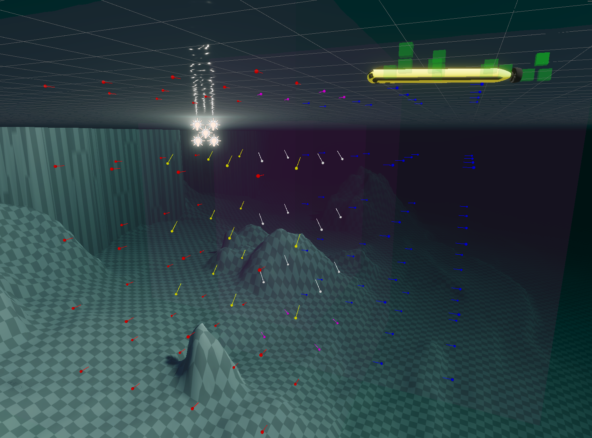
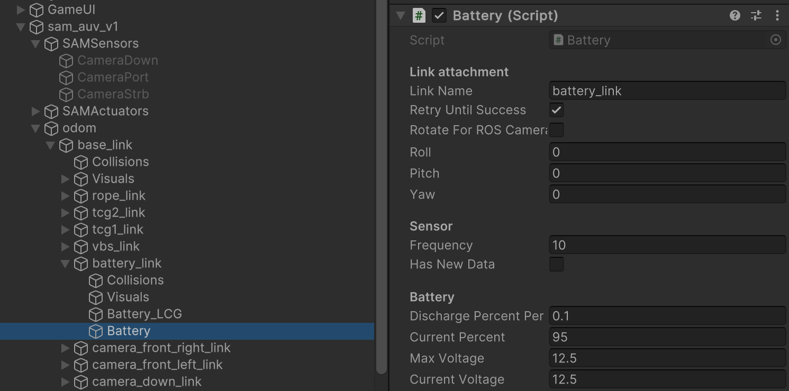

# SMaRC Unity Assets
**Table of contents:**
- [SMaRC Unity Assets](#smarc-unity-assets)
  - [General Concepts and Phrases](#general-concepts-and-phrases)
  - [Force](#force)
    - [ForcePoint](#forcepoint)
    - [OOOForceModel](#oooforcemodel)
  - [Water](#water)
    - [SimpleWaterQueryModel](#simplewaterquerymodel)
    - [SimpleWaterCurrent](#simplewatercurrent)
  - [Vehicle Components](#vehicle-components)
      - [LinkAttachment](#linkattachment)
    - [Acoustics](#acoustics)
      - [Transceiver(TX)](#transceivertx)
        - [Occlusions](#occlusions)
        - [Propagation speed](#propagation-speed)
        - [Surface echoes](#surface-echoes)
        - [Bottom echoes](#bottom-echoes)
    - [Actuators](#actuators)
      - [Hinge](#hinge)
      - [Prismatic](#prismatic)
      - [Propeller](#propeller)
      - [VBS](#vbs)
    - [Sensors](#sensors)
      - [Sensor](#sensor)
      - [Battery](#battery)
      - [Camera Image](#camera-image)
      - [DepthPressure](#depthpressure)
      - [DVL](#dvl)
      - [GPS](#gps)
        - [GPSReferencePoint](#gpsreferencepoint)
      - [IMU](#imu)
      - [Leak](#leak)
      - [Sonar](#sonar)
    - [ROS](#ros)
      - [Core](#core)
        - [RosMessages](#rosmessages)
        - [Clock](#clock)
        - [ROSPublisher](#rospublisher)
      - [Publishers](#publishers)
        - [TF](#tf)
      - [Subscribers](#subscribers)
  - [Rope](#rope)
  - [Importer](#importer)
  - [Drone](#drone)
  - [GameUI](#gameui)


## General Concepts and Phrases
- **Body**: Refers to either an Articulation Body(AB), or a Rigidbody(RB) in Unity. 
Since most of the time these two share the physical properties, we refer to them collectively as Bodies.

- **Standard**: The Standard Unity project found [here](https://github.com/smarc-project/SMARCUnityStandard)

- **HDRP**: The High Def. Rendering Pipeline Unity project found [here](https://github.com/smarc-project/SMARCUnityHDRP)


## Force
Simulation of water-related custom forces that are applied to Bodies. 

### ForcePoint
A generalized massless point in space where external forces are applied.
This script is usually attached to many GameObjects and made child of a Body. 
Most commonly used for approximate buoyancy forces, water currents and gravity. 
For buoyancy and water currents, queries the [Water](#water) model to check for depth and current vector.

The more of these you put on a vehicle and the denser they are, the more accurate the forces will become.

Example:

The force points are shown as magenta spheres. 
They are children to the `base_link` object which contains a Body.

### OOOForceModel
An analytical model of a vehicle. Since Unity only provides a rigid body simulation, some physical modelling (like hydrodynamic forces, damping) must be done "manually". 
These "ForceModel" scripts do just that and are specific to the vehicle they model, such as SAM and BlueROV.


## Water
We do not simulate water as particles, but as vector fields and a surface.
[ForcePoint](#forcepoint)s are used to apply the appropriate forces.

### SimpleWaterQueryModel
Used to define an interface for any object within the Unity world to get the Y(height) value of the water surface at a given point.
While in Standard the water surface is a plane at a fixed Y, in HDRP water surface is simulated with waves and thus has different heights at different times and locations.

This is used for GPS fixes, pressure measurements, buoyancy forces and so on.

HDRP Water:


### SimpleWaterCurrent
A simple vector field within a volume that applies forces to any ForcePoints within it.
Used to simulate currents within that volume.

Two volumes with different currents, mixing in overlapping regions.
Currents visualized with WaterCurrentVisualizer:



## Vehicle Components
These are the components that can be collected within a vehicle: usually sensors and actuators.
Optionally with ROS connections.
Most of them reflect real objects and some are abstractions.

- A general idea used for vehicle components is that the structure of the vehicle and its functional parts are defined separately within the robot object.
  - The structure part only contains geometry and Bodies, essentially reflecting a URDF file.
  - The functional parts are all agnostic to their poses, like a packaged real sensor, they can be mounted anywhere.

#### LinkAttachment
A base class that most sensors and actuators extend. 

In general, we aim to keep the _function_ of a component and its _pose_ separete from each other: Many robots are defined with URDF files which only define a geometric structure of where everything is and connected to what. 
These URDF files tend to change over the lifetime of a robot, a camera is moved elsewhere, some sensor is turned around, but the component itself does not change, only it's _pose_. 

> Imagine the LinkAttachment mechanism as the ability to disassemble a robot on a table.
> Unlike reality, our robots can assemble themselves automatically at run-time :)

- A GameObject with a LinkAttachment component is given a string name in the editor.
- At `Awake()` this GameObject's parent is set to be the GameObject with the given name that is under the same root object.

> If you have written a new LinkAttachment-extending class, and need to use the `Awake()` method yourself, you need to call `Attach()` manually.
> See for example `Sonar.cs`.

For example, a Battery object. Before play mode, it is under `sam_auv_v1/SAMSensor`:

And at play mode, it is under `sam_auv_v1/odom/base_link/battery_link`:


- Rotate For ROS Camera: The camera origin is different in Unity and in ROS.
Checking this box ON rotates the LinkAttachment object to match the ROS standard.
- The Roll/Pitch/Yaw fields can be used to rotate the LinkAttachment object _after_ it is attached.
In general it is a better idea to modify the structure part of the robot (usually the URDF) instead of using this.


### Acoustics
Peer to peer acoustic communications.

#### Transceiver(TX)
Simulates both a receiver and a transmitter of acoustic signals at the package level. 
The main way to interact with a transceiver are its `Read()` and `Write()` methods.
- `Read()`: Returns a StringStamped object that was received first. Contains the data as a string, the time it was sent and the time it was received.
- `Write()`: Takes a string and puts it in the write-queue. The string is broadcast in the next `FixedUpdate()`, first-in-first-out.

We provide different levels of realism when simulating a transceiver:

##### Occlusions
We make use of sphere-casting to determine occlusions.
When a transceiver broadcasts, it performs a sphere-cast to _every_ other transceiver in the scene.
If the cast is free of obstacles, we consider that path free.
The required obstacle-free width can be configured.

##### Propagation speed
We use coroutines to simulate the propagation speed of sound.
If the path is clear and the target is within range, a coroutine is started: The target's `Receive()` method is called after a delay depending on the distance between the source and target. 

This simulates the arrival timing of any packages and can be used for triangulation purposes.

##### Surface echoes
The most common source of echoes comes from the surface.
Since the physics involved in the production of echoes is too complex to be simulated at high rates, we approximate surface echoes as follows:

- Assume the surface is a plane defined by the horizontal position of the transceiver, the vertical position of the [Water](#water) model and the vector opposite gravity.
- Create a reflection of the transceiver around this plane.
- Sphere-cast from the reflection point to the target transceiver.
- Find the intersection of this ray and the plane. This is the "bounce point".
- Sphere-cast from source TX to the "bounce point" for occlusion check.
- Sphere-cast from "bounce point" to target TX for occlusion check.
- If no occlusions, find distance of source -> "bounce point" -> target.
- Check if distance is less than maximum range reduced by a configurable echo-loss.
- Start the [receiveing coroutine](#propagation-speed) with the in-direct distance.

```
                  O' selfReflectionPos
                  |\
                  | \
 water plane ~~~~~~~~E~~~~~~~~ E=echoPoint
                  | / \
                  |/   \
          selfPos O     T targetPos 
```

> This method allows us to use only 3 raycasts per pair to create surface echoes, so it can be enabled without much concern about performance.


##### Bottom echoes
The second-most common source of echoes.
Unlike surface echoes, a flat-bottom assumption is harder to justify for the bottom, since sheer walls, crevices, rocks and other similar non-smooth objects can create such echoes.

We follow the following "shotgun" approach:
- Sphere-cast from the source TX towards equidistant points on a bottom-half-dome.
- For all non-occluded rays, sphere-cast a reflected version.
- Find intersection of reflected rays and a horizontal plane at the Y-position of the target TX.
- For all non-occluded rays, check the distance between reflection-ray-hits and the target TX.
- If any are within a configurable range, find the closest.
- Use the distance of source -> "bounce point" -> target for the [receiveing coroutine](#propagation-speed).

> This method uses many raycasts to determine a path and should be enabled with caution.
> The number and pattern of rays are configurable by passing a mesh to the transceiver. The vertices of the mesh will be used for bottom echoes.

> Note that this method uses a terrain object with a terrain collider as the source for its bottom and considers everything else as occlusions. Any bottom features that you expect echoes from should be part of the terrain and not separate objects.


### Actuators
Scripts that control articulation bodies using drives defined within.

#### Hinge
A simple hinge. Rotates.

#### Prismatic
A piston. Moves back and forth.

#### Propeller
A propeller blade. Turns, pushes and torques.

#### VBS
A tank. Fills up and empties to change its mass.

### Sensors
They sense things and store the information within.

#### Sensor
The base class of most sensors. Handles time related stuff in a general way.

#### Battery
A battery. Discharges over time.

#### Camera Image
A camera. Attach a Unity camera too.

#### DepthPressure
Outputs depth through pressure. Uses [water](#water).

#### DVL
Beams into velocities.

#### GPS
Globally positions the system. 

##### GPSReferencePoint
Somewhere in Unity is somewhere in real world.

#### IMU
Internally measures units.

#### Leak
Not the vegetable.

#### Sonar
Ping.


### ROS

#### Core

##### RosMessages
Where all the messages live.

##### Clock
Tick tock

##### ROSPublisher
Base class of most publishers. Handles timing stuff.

#### Publishers
`_Pub`

##### TF


#### Subscribers
`_Sub`


## Rope
Lots of strings attached.

## Importer
URDF into Unity, JSON out of Unity

## Drone
It flies.

## GameUI
Looks pretty? Sometimes.
